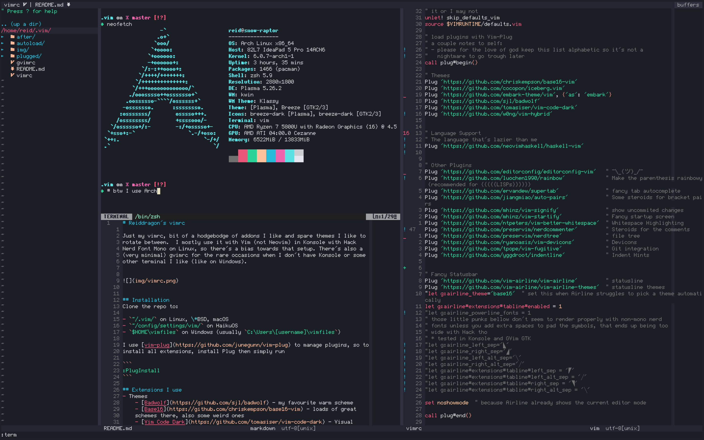

# Reiddragon's vimrc

Just my vimrc, bunch of addons I find useful, and some themes I like to rotate
between. I mostly use it with Vim (not Neovim) in Kitty or GVim, with Roboto
Mono, or Fairfax SM, on Linux, so there's a bias towards those combos.





## Installation
Clone the repo to:

- `~/.vim/` on Linux, \*BSD, macOS
- `~/config/settings/vim/` on HaikuOS
- `$HOME\vimfiles` on Windows (usually `C:\Users\[username]\vimfiles`)

I use [vim-plug](https://github.com/junegunn/vim-plug) to manage plugins, so to
install all extensions, install Plug then simply run

```
:PlugInstall
```

## Extensions I use
- Themes
    - [Base16](https://github.com/chriskempson/base16-vim) - loads of great
    schemes there, also some weird ones
    - [Code Dark](https://github.com/tomasiser/vim-code-dark) - for le epic
    memez aka when I want to see who notices this isn't VS Code :P
    - [C64](https://github.com/tssm/c64-vim-color-scheme) - because some looks
    are just too legendary, even if they're not that great for coding
    - [Embark](https://github.com/embark-theme/konsole/) - amazing neon scheme,
    using it with [\[shameless
    plug\]](https://github.com/Reiddragon/embark-konsole)
    - [Kyoto Night](https://github.com/laniusone/kyotonight.vim) - like Tokyo
    Night, but in a different city
    - [Gruvbox](https://github.com/morhetz/gruvbox) - Because sometimes me
    likey warm schemes
    - [Iceberg](https://github.com/cocopon/iceberg.vim) - amazing cold scheme
    - [Nightfox](https://github.com/EdenEast/nightfox.nvim)
    - [Substrata](https://github.com/arzg/vim-substrata) - cold scheme, damn
    great with Roboto Mono
    - [Wal](https://github.com/dylanaraps/wal.vim) - theme to better integrate Vim with [Pywal](https://github.com/dylanaraps/pywal/), doesn't work with `termguicolours` or GVim
    - [Zenburn](https://github.com/jnurmine/Zenburn) - Alien fruit salad

- Additional Language Support Plugins (for stuff Polyglot doesn't cover)
    - [Hy](https://github.com/hylang/vim-hy)
    - [Onnisharp](https://github.com/OmniSharp/Omnisharp-vim) and
    [SharpenUp](https://github.com/nickspoons/vim-sharpenup)

- Linting
    - [Asynchronous Lint Engine](https://github.com/dense-analysis/ale)
    - [vim-lsp](https://github.com/prabirshrestha/vim-lsp)
    - [vim-lsp-ale](https://github.com/rhysd/vim-lsp-ale) - bridge to make ALE and vim-slp play nicely together
    - [vim-lsp-settings](https://github.com/mattn/vim-lsp-settings) - to manage LSP servers

- Other Plugins
    - [Airline](https://github.com/vim-airline/vim-airline) and [Airline
    Themes](https://github.com/vim-airline/vim-airline-themes) - fancy
    statusline
    - [Auto Pairs](https://github.com/jiangmiao/auto-pairs) - steroids for
    bracket pairs
    - [Better Whitespace](https://github.com/ntpeters/vim-better-whitespace) -
    Whitespace trimming and highlighting
    - [EditorConfig](https://github.com/editorconfig/editorconfig-vim)
    - [DevIcons](https://github.com/ryanoasis/vim-devicons) - add nerdfont
    icons to NERDTree, Airline and other plugins
    - [Fugitive](https://github.com/tpope/vim-fugitive) - fancy git integration
    - [Indent Line](https://github.com/yggdroot/indentline) - indentation hints
    - [NERDCommenter](https://github.com/preservim/nerdcommenter)
    - [NERDTree](https://github.com/preservim/nerdtree) - great tree file view
    - [Polyglot](https://github.com/sheerun/vim-polyglot) - Ash durbatulûk, ash
    gimbatul, ash thrakatulûk, agh burzum-ishi krimpatul
    - [Vim-Slime](https://github.com/jpalardy/vim-slime) - for REPL shennanigans
    - [supertab](https://github.com/ervandew/supertab) - nice on-demand tab
    completion
    - [vim-startify](https://github.com/mhinz/vim-startify) - fancy start
    screen
    - [Rainbow](https://github.com/luochen1990/rainbow) - makes parenthesis and
    brackets all rainbowy, especially useful for LISPs
    - [Signify](https://github.com/mhinz/vim-signify) - adds indicators for
    changes since the last git commit
    - [Startify](https://github.com/mhinz/vim-startify) - fancy Vim start page
    - [Terminus](https://github.com/wincent/terminus) - some goodies to improve
    The Vim Experience(TM) in a terminal


