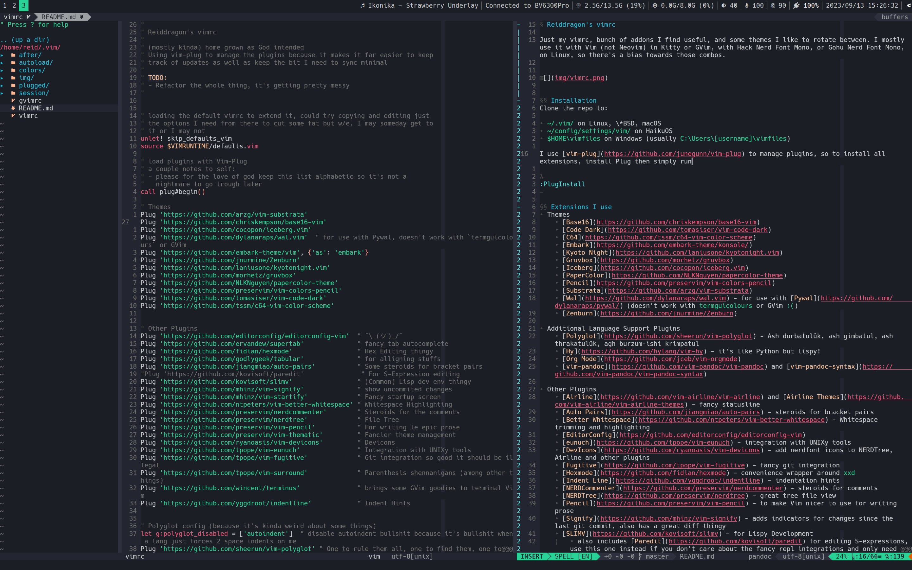

# Reiddragon's vimrc

Just my vimrc, bit of a hodgebodge of addons I like and spare themes I like to
rotate between.  I mostly use it with Vim (not Neovim) in Konsole with Hack
Nerd Font Mono on Linux, so there's a bias towards that setup. There's also a
(very minimal) gvimrc for the rare occasions when I don't have Konsole or some
other terminal I like (like on Windows).  





## Installation
Clone the repo to:

- `~/.vim/` on Linux, \*BSD, macOS
- `~/config/settings/vim/` on HaikuOS
- `$HOME\vimfiles` on Windows (usually `C:\Users\[username]\vimfiles`)

I use [vim-plug](https://github.com/junegunn/vim-plug) to manage plugins, so to
install all extensions, install Plug then simply run

```
:PlugInstall
```

## Extensions I use
- Themes
    - [Badwolf](https://github.com/sjl/badwolf) - my favourite warm scheme
    - [Base16](https://github.com/chriskempson/base16-vim) - loads of great
    schemes there, also some weird ones
    - [Vim Code Dark](https://github.com/tomasiser/vim-code-dark) - Visual
    Studio default scheme ported to Vim, because why not
    - [Embark](https://github.com/embark-theme/vim) - amazing neon scheme,
    using it with [\[shameless
    plug\]](https://github.com/Reiddragon/embark-konsole)
    - [Everforest](https://github.com/sainnhe/everforest)
    - [Iceberg](https://github.com/cocopon/iceberg.vim) - amazing cold scheme
    - [Rainglow](https://github.com/rainglow/vim) - theme collection with some
    interesting picks

- Language Support Plugins
    - [OmniSharp](https://github.com/OmniSharp/Omnisharp-vim) and
    [SharpenUp](https://github.com/nickspoons/vim-sharpenup) - support for
    dotnet languages

- Other Plugins
    - [Airline](https://github.com/vim-airline/vim-airline) and [Airline
    Themes](https://github.com/vim-airline/vim-airline-themes) - fancy
    statusline
    - [Asynchronous Lint Engine](https://github.com/dense-analysis/ale)
    - [vim-lsp](https://github.com/prabirshrestha/vim-lsp)
    - [vim-lsp-ale](https://github.com/rhysd/vim-lsp-ale) - to make sure
    vim-lsp and ALE use the same language servers instead of each starting its
    own
    - [vim-lsp-settings](https://github.com/mattn/vim-lsp-settings) - mostly
    using it to manage language servers
    - [Auto Pairs](https://github.com/jiangmiao/auto-pairs) - steroids for
    bracket pairs
    - [Better Whitespace](https://github.com/ntpeters/vim-better-whitespace) -
    Whitespace trimming and highlighting
    - [EditorConfig](https://github.com/editorconfig/editorconfig-vim)
    - [DevIcons](https://github.com/ryanoasis/vim-devicons) - add nerdfont
    icons to NERDTree, Airline and other plugins
    - [Fugitive](https://github.com/tpope/vim-fugitive) - fancy git integration
    - [fzf.vim](https://github.com/junegunn/fzf.vim)
    - [Indent Line](https://github.com/yggdroot/indentline) - indentation hints
    - [NERDCommenter](https://github.com/preservim/nerdcommenter)
    - [NERDTree](https://github.com/preservim/nerdtree) - great tree file view
    - [supertab](https://github.com/ervandew/supertab) - nice on-demand tab
    completion
    - [vim-startify](https://github.com/mhinz/vim-startify) - fancy start
    screen
    - [Rainbow](https://github.com/luochen1990/rainbow) - makes parenthesis and
    brackets all rainbowy, especially useful for LISPs
    - [Signify](https://github.com/mhinz/vim-signify) - adds indicators for
    changes since the last git commit
    - [Startify](https://github.com/mhinz/vim-startify) - fancy Vim start page
    - [Vimspector](https://github.com/puremourning/vimspector) - mostly using
    this for the OmniSharp Debugger in case I ever need it


### "Why in the name of Emacs are you using both ALE and vim-lsp?!?"
They each have features that I use and that the other doesn't have, and since
the bridge exists, why not?


